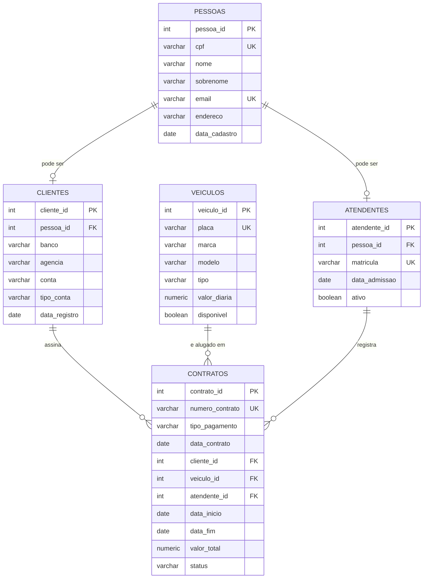

# Aluguel de Carros

## 1. Apresentação do Projeto

**Tema:** Aluguel de Carros

**Objetivo geral:** Modelar e implementar, em PostgreSQL, um banco de dados relacional para uma empresa de aluguel de veículos com foco em motoristas de aplicativos (Uber, 99, iFood, etc.). O sistema permite cadastrar veículos (motos, carros de passeio e caminhões), clientes com seus dados bancários, atendentes responsáveis pelo cadastro/negociação, e os contratos de locação, com tipo de pagamento e período de vigência.

Assim como em outros domínios de atendimento, uma regra de negócio importante é que **um atendente também pode ser cliente** da empresa (por exemplo, um funcionário que também aluga um veículo). Por isso, o modelo mantém os dados pessoais comuns em uma tabela única (`pessoas`), da qual `atendentes` e `clientes` derivam por relacionamento 1:1, evitando duplicidade de CPF/e-mail e permitindo que a mesma pessoa acumule os dois papéis.

**Público-alvo:** Empresas de locação de veículos que atendem motoristas de aplicativo, precisando controlar frota, clientes, contratos de aluguel e formas de pagamento.

## 2. Modelo de Dados Relacional

### 2.1 Entidades

- **pessoas**: dados cadastrais únicos de qualquer indivíduo (CPF, nome, e-mail, endereço).
- **atendentes**: papel de atendente, vinculado a uma pessoa (1:1).
- **clientes**: papel de cliente, vinculado a uma pessoa (1:1), incluindo dados bancários. Uma pessoa pode ter os dois papéis.
- **veiculos**: frota disponível para locação (placa, marca, modelo, tipo).
- **contratos**: contrato de locação, ligando cliente, veículo, atendente responsável, tipo de pagamento e período de vigência.

### 2.2 Diagrama (Mermaid)



## 3. Regras de Integridade Implementadas

- `pessoas.cpf` e `pessoas.email` são `UNIQUE` e `NOT NULL`.
- `atendentes.pessoa_id` e `clientes.pessoa_id` são `UNIQUE` (relacionamento 1:1 com `pessoas`) e possuem `ON DELETE CASCADE`.
- `veiculos.placa` é `UNIQUE` e `NOT NULL`; `veiculos.tipo` é restrito por `CHECK` a `MOTO`, `CAMINHAO` ou `CARRO_PASSEIO`.
- `contratos.numero_contrato` é `UNIQUE`; `contratos.tipo_pagamento` é restrito por `CHECK` a `CARTAO` ou `PIX`.
- `contratos.status` é restrito por `CHECK` a `ATIVO`, `FINALIZADO` ou `CANCELADO`.
- `contratos` possui `CHECK` garantindo que `data_fim >= data_inicio` (período de vigência válido).

## 4. Estrutura de Scripts

Todos os scripts estão na pasta [`scripts/`](./scripts), seguindo a convenção:

```
[versão]__[ação]_[descrição/objeto].sql
```

| Script | Descrição |
|---|---|
| `v1__create_table_pessoas.sql` | Cria a tabela `pessoas` |
| `v1__create_table_atendentes.sql` | Cria a tabela `atendentes` |
| `v1__create_table_clientes.sql` | Cria a tabela `clientes` (com dados bancários) |
| `v1__create_table_veiculos.sql` | Cria a tabela `veiculos` |
| `v1__create_table_contratos.sql` | Cria a tabela `contratos` |
| `v1__insert_into_pessoas.sql` | Popula `pessoas` com dados de exemplo |
| `v1__insert_into_atendentes.sql` | Popula `atendentes` |
| `v1__insert_into_clientes.sql` | Popula `clientes` |
| `v1__insert_into_veiculos.sql` | Popula `veiculos` |
| `v1__insert_into_contratos.sql` | Popula `contratos` |
| `v2__create_view_contratos_detalhado.sql` | Cria a view `contratos_detalhado`, com dados legíveis (nomes em vez de IDs) |
| `v2__update_contratos_status.sql` | Exemplos de `UPDATE` para validar as regras de negócio |
| `v2__delete_contrato_teste.sql` | Exemplos de `DELETE` para validar a integridade referencial |

## 5. Como executar

1. Crie um banco de dados no PostgreSQL:
   ```sql
   CREATE DATABASE aluguel_carros;
   ```
2. Execute os scripts na pasta `scripts/` em ordem numérica (v1 antes de v2), por exemplo via `psql`:
   ```bash
   psql -U seu_usuario -d aluguel_carros -f scripts/v1__create_table_pessoas.sql
   psql -U seu_usuario -d aluguel_carros -f scripts/v1__create_table_atendentes.sql
   # ... e assim por diante
   ```
   Todos os scripts de criação usam `CREATE TABLE IF NOT EXISTS` / `CREATE OR REPLACE`, podendo ser reexecutados sem erro.

## 6. Autor

**Thallis Gabriel dos Santos Lima Vital**
2° Período — Ciência da Computação
Projeto desenvolvido como atividade prática da disciplina de Banco de Dados.
